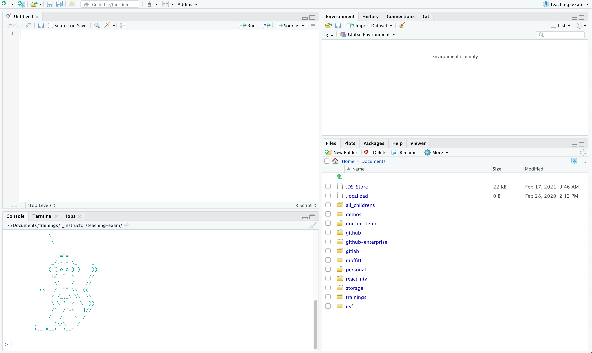
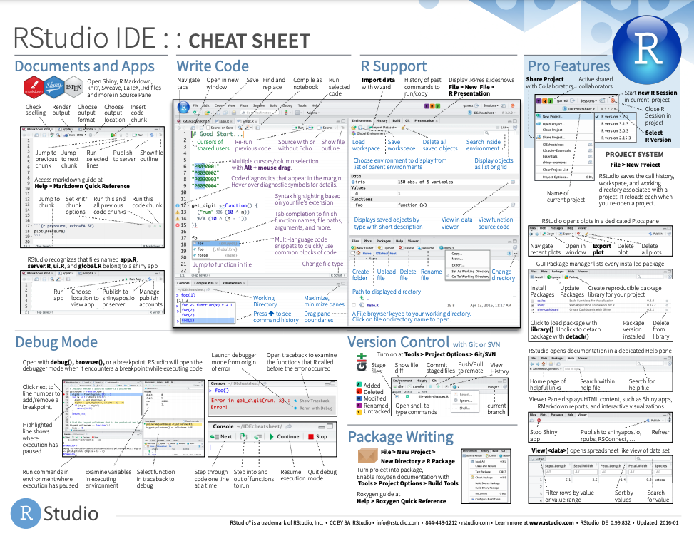
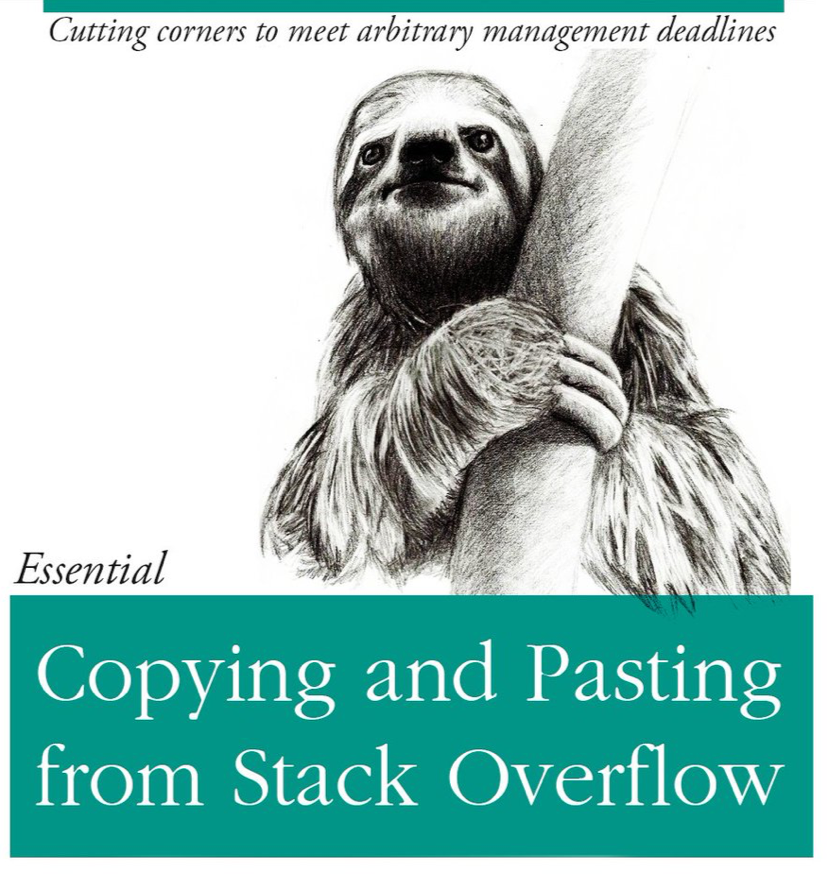
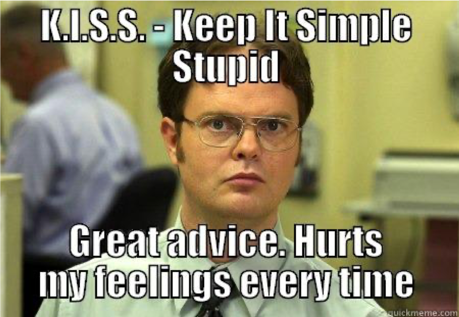

```{r setup, include=FALSE}
options(htmltools.dir.version = FALSE)
knitr::opts_chunk$set(
  fig.width=9, fig.height=3.5, fig.retina=3,
  out.width = "100%",
  cache = FALSE,
  echo = TRUE,
  message = FALSE, 
  warning = FALSE, 
  hiline = TRUE
)
options(width = 70)
```

name: title
class: left bottom hide-count

<!-- Slide Extras -->

```{r xaringan-extras, echo=FALSE, results="asis"}
# remotes::install_github("gadenbuie/xaringanExtra")
xaringanExtra::use_xaringan_extra(c(
  "tile_view"
  # "editable",
  # "animate",
  # "panelset"
))
```

<!-- Title Slide -->
<!-- <div class="talk-logo"></div> -->

.talk-meta[
.talk-title[
# `r rmarkdown::metadata$title`

`r rmarkdown::metadata$subtitle`
]

.talk-author[
`r paste(rmarkdown::metadata$author, collapse = " &middot; ")`<br>
.moffitt-gray[`r paste(rmarkdown::metadata$institute, collapse = ", ")`]
]

.talk-date.moffitt-gray[
`r knitr::knit(text = rmarkdown::metadata$date)`
]
]


```{css echo=FALSE}
/* Define title slide image or logo here */
.talk-logo {
  width: 400px;
  height: 750px;
  position: absolute;
  top: 6%;
  right: 7%;
  /* background-image: url('img/r4ds-cover.png'); */
  background-size: contain;
  background-repeat: no-repeat;
  background-position: contain;
}
```

<!-- Moffitt Logo and Slide Border ----

All slides except "title" and "inverse" slides
have the Moffitt Color Bar and logo.

Additional classes are provided to disable both:

- `class: no-logo` hides the logo
- `class: no-border` hides the border

or to force either to be shown

- `class: moffitt-slide-logo` shows the logo
- `class: moffitt-slide-border` shows the border
-->

---

## What we are going to cover

*   Installing R and RStudio
*   Basics of programming 
*   GitHub
*   Best coding practices (if we have time)

---
class: inverse center middle

# R & RStudio

---

## Installing R and RStudio

*   Download R from CRAN (https://cran.r-project.org/)
    *   use the cloud mirror
    *   need to update with each major release (about once a year)

*   RStudio can be downloaded from the rstudio site (http://www.rstudio.com/download)
    *   updated regularly

---

### RStudio 



???

RStudio a GUI for the R language. 

---
## R Code 

Two major elements:

*   Functions
*   Objects 

---
## Data Types 

Data types: 

*   logical - `TRUE` or `FALSE`
*   numeric or integer - `22.2`
*   character - `"character example"`

---
## Data Structures
    
Data structures: 
    
*   vector - `c(1:4, 5, 6)`
*   list - `list(c(1:4), 12, "banana")`
*   matrix 
*   dataframe/tibble
    
`tibble` and `dataframe` - look and perform virtually the same with the biggest difference 
being that `dataframes` have rows and `tibbles` do not 

---



[r cheatsheets](https://www.rstudio.com/resources/cheatsheets/)

---
### Packges

A `package` is a collection of functions, data, and documentation that extend
the functionality of R.

`install.packages("foo")`

vs

`library("foo")`

This course focuses on using a set of packages commonly referred to as the 
`tidyverse`

---
## R Projects & `here()`

Working directory = where R looks for your files 

Setting absolute paths can be problematic - especially if you are working on a
project that uses Windows/Mac/Linux

R Projects provide a structure for storing all files, data, scripts and output for 
a project

To create a new Project: `File` > `New Directory` > `New Project`
and fill out the information  

---

## GitHub

.pull-left[
* GitHub is a code hosting platform used for collaborating and code sharing
* Materials and information for the course can be found on the class GitHub page
* Class GitHub: [https://github.com/FridleyLab/Intro_to_R_2023](https://github.com/FridleyLab/Intro_to_R_2023)
]

.pull-right[]

---

## GitHub basics

**What is GitHub?**

  - Code hosting platform
  - Used for version control
  - GitHub, GitHub Enterprise, GitLab (`r emo::ji("meh")`)

**Why do we care?**

  - Distribute R packages
  - Collaborate on code
  - Explore other projects 
  - Project manager
  - Repos are **CITABLE**
  
`r emo::ji("coder")` Paul Stewart of the Moffitt BioData Club does a Git
training about once a year which I highly recommend if you are interested in
learning more about Git [https://github.com/pstew/biodataclub/tree/master/meetings/2018-10_git](https://github.com/pstew/biodataclub/tree/master/meetings/2018-10_git)

---

## R Community and Resources

.pull-left[

* [Stack Overflow](https://stackoverflow.com/questions/tagged/r)
* [R Community](https://community.rstudio.com/)
* [R for Data Science](https://r4ds.had.co.nz/)
    * Anything written by Hadley Wickham, Garret Grolemund,
    Yihui Xie, Jenny Bryan 
* [#rstats](https://twitter.com/hashtag/rstats?lang=en)

]

.h-10.pull-right[



]

---
class: inverse center middle

# To RStudio!

---
class: inverse center middle

# Best Practices

---

## Have you tried turning it off and then on again?

-   Start with a new, clean session
-   Re-start often

---

## Naming things 

.pull-left[

Good names should be:

-   machine readable 
    - no spaces, strange punctuation, or odd cases
-   human readable 
    - name contains details on content
-   works with default ordering
    - numbers first 
    - standard dates (YYYY-MM-DD)
    - left pad numbers 
]

.pull-right[


]

---

## Code Style 

  - Line length around 80 characters
  - Object and data names should be informative
  - Consistency is key - names, indents, spacing
  - [https://style.tidyverse.org/](https://style.tidyverse.org/)

---

## Comments



