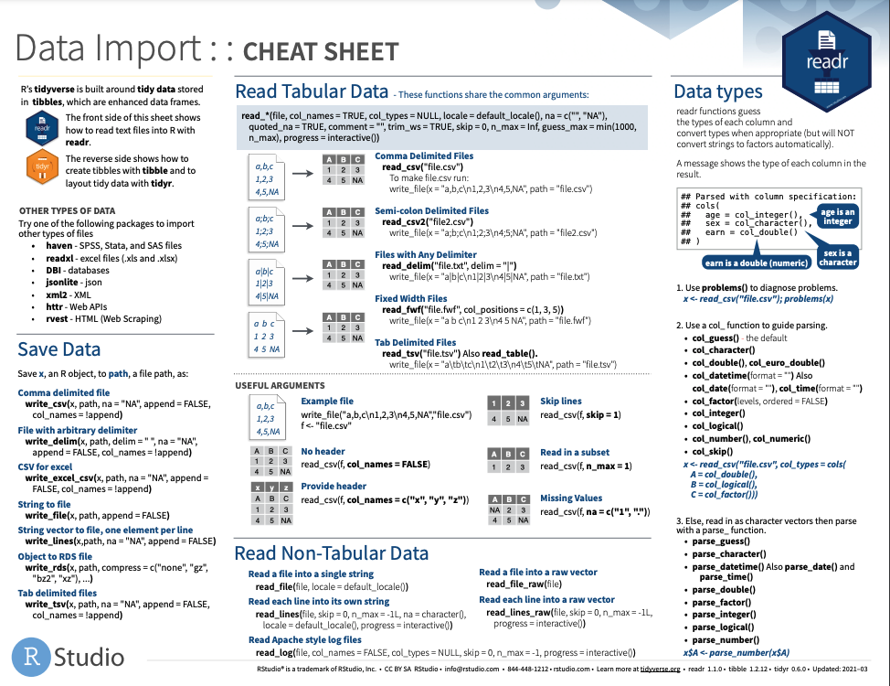
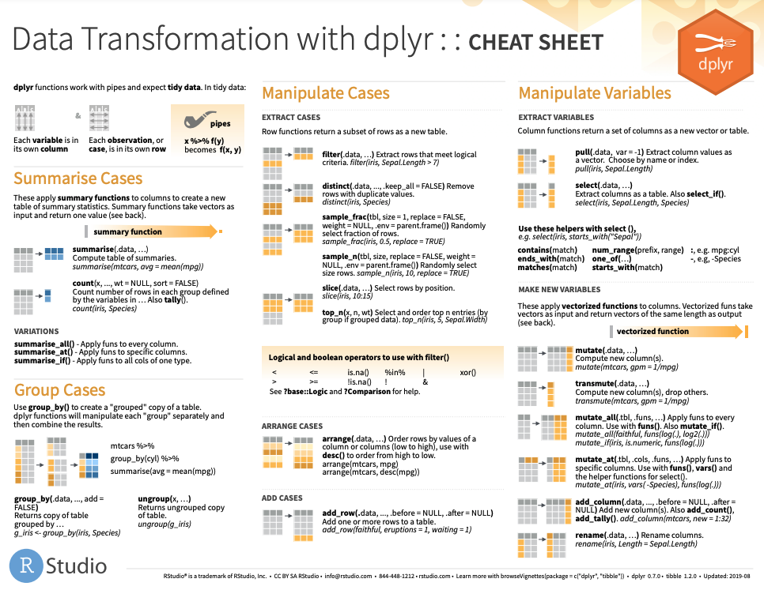

```{r setup, include=FALSE}
options(htmltools.dir.version = FALSE)
knitr::opts_chunk$set(
  fig.width=9, fig.height=3.5, fig.retina=3,
  out.width = "100%",
  cache = FALSE,
  echo = TRUE,
  message = FALSE, 
  warning = FALSE, 
  hiline = TRUE
)
options(width = 70)
```

name: title
class: left bottom hide-count

<!-- Slide Extras -->

```{r xaringan-extras, echo=FALSE, results="asis"}
# remotes::install_github("gadenbuie/xaringanExtra")
xaringanExtra::use_xaringan_extra(c(
  "tile_view"
  # "editable",
  # "animate",
  # "panelset"
))
```

<!-- Title Slide -->
<!-- <div class="talk-logo"></div> -->

.talk-meta[
.talk-title[
# `r rmarkdown::metadata$title`

`r rmarkdown::metadata$subtitle`
]

.talk-author[
`r paste(rmarkdown::metadata$author, collapse = " &middot; ")`<br>
.moffitt-gray[`r paste(rmarkdown::metadata$institute, collapse = ", ")`]
]

.talk-date.moffitt-gray[
`r knitr::knit(text = rmarkdown::metadata$date)`
]
]


```{css echo=FALSE}
/* Define title slide image or logo here */
.talk-logo {
  width: 400px;
  height: 750px;
  position: absolute;
  top: 6%;
  right: 7%;
  /* background-image: url('img/r4ds-cover.png'); */
  background-size: contain;
  background-repeat: no-repeat;
  background-position: contain;
}
```

<!-- Moffitt Logo and Slide Border ----

All slides except "title" and "inverse" slides
have the Moffitt Color Bar and logo.

Additional classes are provided to disable both:

- `class: no-logo` hides the logo
- `class: no-border` hides the border

or to force either to be shown

- `class: moffitt-slide-logo` shows the logo
- `class: moffitt-slide-border` shows the border
-->

---
## What we are going to cover

*   Elements of tidy data 
*   TCGA data
*   Importing data
*   Data cleaning with `dplyr`

---
class: inverse center middle

# What is "tidy" data?

---
## Elements of "tidy" data 

Data comes in all shapes and sizes, but not all data organization is made equal!

3 elements of tidy data:

1. Each .blue[variable] has its own .blue[column]
2. Each .blue[observation] has its own .blue[row]
3. Each .blue[value] has it own .blue[cell]

.blank[blank line]

.blank[blank line]

.blank[blank line]

`r emo::ji("point_right")` For more information please see chapter 12 of [R for Data Science](https://r4ds.had.co.nz/tidy-data.html)

---
## Elements of "tidy" data 


---
class: inverse center middle

# TCGA Data

---
## The Cancer Genome Atlas (TCGA)

TCGA is the large cancer genomics program spanning 33 cancer types and 
multiple institutions. 

  * HNSC - Head and neck squamous cell carcinoma
  * KIRC - Kidney renal clear cell carcinoma
  
Data is saved as two `.csv`s : `data/tcga-clinical.csv` and `data/tcga-gene-exp.csv`

---
class: inverse center middle

# Importing files

---
## Import method depends on file type!

*   Most text files : `readr::read_delim()` or `readr::read_csv()`
*   Microsoft excel files : `readxl::read_excel()`
*   R data files : `load()`
*   SAS data files: `haven::read_sas()`

`r emo::ji("coder")` remember to copy code from the import gui to your scripts!

---



---
class: inverse center middle

# Data cleaning with dplyr 

---
## `dplyr` verbs and syntax 

`select()` subset columns
* `select(tibble_name, variable1, variable2)`

`mutate()` create new variables/columns
* `mutate(tibble_name, new_variable = variable1*2)`

---
## common `select()` options 

`:` selects a range of columns

`-` selects every column but those specified 

`starts_with()` and `ends_with()` selects columns whose names start/end with 
the specified string 

`contains()` selects columns whose names contain the specified string

---
## `dplyr` verbs and syntax 

`filter()` subset rows
* `filter(tibble_name, variable1 == "specific value")`

`summarise()` aggregates rows
* `summarise(tibble_name, avg_value = mean(variable1))`

`arrange()` orders rows 
* `arrange(tibble_name, variable1)`

.blank[blank line]

Operations can be chained together with the pipe operator (`%>%`) 

---
## logical tests for `filter()` 

*   `==` : equal
*   `!=` : not equal
*   `<` & `<=` : less than & less than or equal to
*   `>` & `>=` : greater than & greater than or equal to
*   `|` : or
*   `&` : and
*   `!` : not
*   `%in%` : in the set 

---
## `dplyr` helpers 

`n()` the number of rows 

`n_distinct()` the number of unique values for a variable

`group_by()` collects observations by a common value

`%>%` pipe used to join commands together

---




```{css, echo=FALSE}
.blank { 
  color: white ;
}


```
