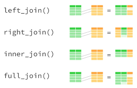
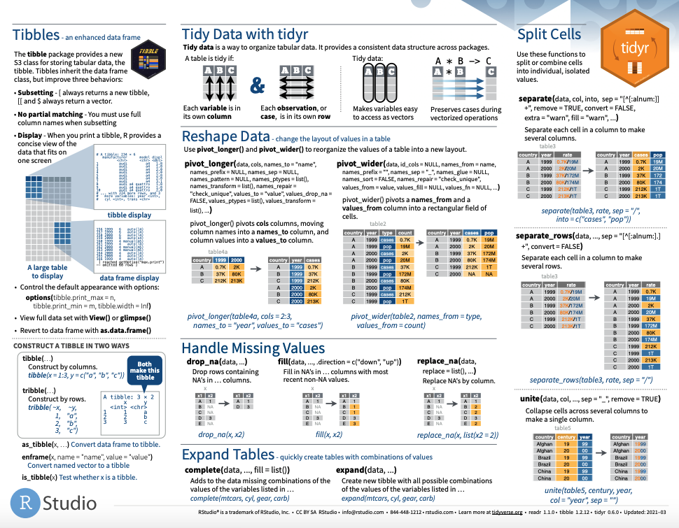

```{r setup, include=FALSE}
options(htmltools.dir.version = FALSE)
knitr::opts_chunk$set(
  fig.width=9, fig.height=3.5, fig.retina=3,
  out.width = "100%",
  cache = FALSE,
  echo = TRUE,
  message = FALSE, 
  warning = FALSE, 
  hiline = TRUE
)
options(width = 70)
```

name: title
class: left bottom hide-count

<!-- Slide Extras -->

```{r xaringan-extras, echo=FALSE, results="asis"}
# remotes::install_github("gadenbuie/xaringanExtra")
xaringanExtra::use_xaringan_extra(c(
  "tile_view"
  # "editable",
  # "animate",
  # "panelset"
))
```

<!-- Title Slide -->
<!-- <div class="talk-logo"></div> -->

.talk-meta[
.talk-title[
# `r rmarkdown::metadata$title`

`r rmarkdown::metadata$subtitle`
]

.talk-author[
`r paste(rmarkdown::metadata$author, collapse = " &middot; ")`<br>
.moffitt-gray[`r paste(rmarkdown::metadata$institute, collapse = ", ")`]
]

.talk-date.moffitt-gray[
`r knitr::knit(text = rmarkdown::metadata$date)`
]
]


```{css echo=FALSE}
/* Define title slide image or logo here */
.talk-logo {
  width: 400px;
  height: 750px;
  position: absolute;
  top: 6%;
  right: 7%;
  /* background-image: url('img/r4ds-cover.png'); */
  background-size: contain;
  background-repeat: no-repeat;
  background-position: contain;
}
```

<!-- Moffitt Logo and Slide Border ----

All slides except "title" and "inverse" slides
have the Moffitt Color Bar and logo.

Additional classes are provided to disable both:

- `class: no-logo` hides the logo
- `class: no-border` hides the border

or to force either to be shown

- `class: moffitt-slide-logo` shows the logo
- `class: moffitt-slide-border` shows the border
-->

---
class: inverse center middle

# Merging datasets

---
## Mutating `join()` 

Mutating joins combine variables from two data frames

```{r eval=FALSE}
XXX_join(left_data, right_data,by = "id")

XXX_join(left_data, right_data, by = c("left_id" = "right_id"))
```



---
## Filtering `join()` 

`semi_join()` : returns rows from "left" data with matching values in "right" 
data, but only returns columns from "left" data

`anti_join()` : returns rows from "left" data with no matching values in 
"right" data and only returns columns from "left" data

---
class: inverse center middle

# Transposing data

---
## `tidyr` actions 

`r emo::ji("coder")` Tidy data isn't necessarily always long or wide.

`pivot_longer()` and `pivot_wider()` reshape data 
* `pivot_longer(tibble_name, cols = variable1:variable5, names_to = "year", values_to = "count")`
* `pivot_wider(tibble_name, id_cols = variable1, names_from = variable2, values_from = variable3)`

There may be times where you need to combine `pivot_wider()` and `pivot_longer()`

---
class: inverse center middle

# Missing values

---
## Missing values propagate

```{r}

NA + 2

sum(NA, 6, 12)

```

`r emo::ji("coder")` `filter()` on missing values requires special treatment

**FAILS:** `filter(data, variable == NA)`

**WORKS:** `filter(data, is.na(variable))`

---
## `tidyr` actions 

`drop_na()`, `fill()`, and `replace_na()` format missing values
* `drop_na(variable2)` : removes rows with NA for that column
* `fill(variable2)` : fills in missing values with the previous value (up or down)
* `replace_na(list(variable2 = "replacement value"))` : replaces `NA`s with a specified value

---
class: inverse center middle

# Basics of working with strings

---
## `tidyr` actions 

`separate()`, `extract()` and `unite()` split and combine character columns
* `separate(tibble_name, variable1, into = c("new_variable1", "new_variable2"), sep = "-")`
* `extract(tibble_name, variable1, regex="[[:alnum:]]+)")`
    * `extract` uses regex which is outside the scope of this class - so we will not be covering this function
* `unite(tibble_name, "combined_var_name", variable1, variable2, sep = ":")`

---



<!-- --- -->
<!-- class: inverse center middle -->

<!-- # Working with strings -->

<!-- --- -->
<!-- ## `stringr`  -->

<!-- `str_subset(x, pattern)` returns the elements matching the pattern -->

<!-- `str_extract(x, pattern)` returns the text that matches -->

<!-- `str_match(x, pattern)` returns part of the text defined in parentheses -->

<!-- --- -->
<!-- ## `stringr`  -->

<!-- `str_detect(x, pattern)` returns logical value indicating if there is a match -->

<!-- `str_count(x, pattern)` returns the number of matches -->

<!-- `str_locate(x, pattern)` returns the position of the match (start and end) -->


```{css, echo=FALSE}
.blank { 
  color: white ;
}

```
