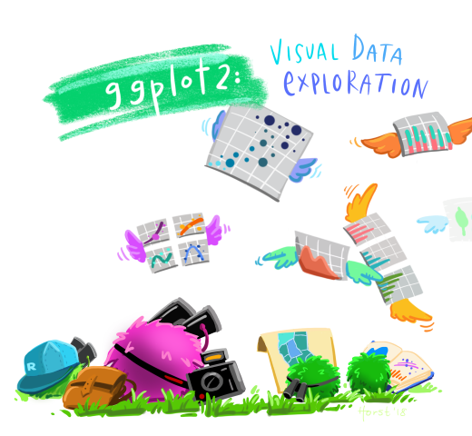
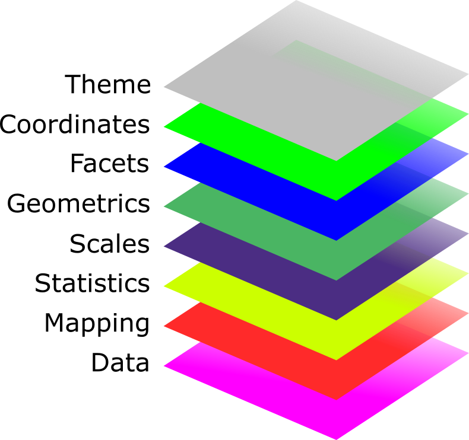

```{r setup, include=FALSE}
options(htmltools.dir.version = FALSE, htmltools.preserve.raw = FALSE)
knitr::opts_chunk$set(
  fig.width=9, fig.height=3.5, fig.retina=3,
  out.width = "100%",
  cache = FALSE,
  echo = TRUE,
  message = FALSE, 
  warning = FALSE, 
  hiline = TRUE
)
options(width = 70)
```

name: title
class: left center hide-count

<!-- Slide Extras -->

```{r xaringan-extras, echo=FALSE, results="asis"}
# remotes::install_github("gadenbuie/xaringanExtra")
xaringanExtra::use_xaringan_extra(c(
  "tile_view"
  # "editable",
  # "animate",
  # "panelset"
))
```

<!-- Title Slide -->
<!-- <div class="talk-logo"></div> -->

.talk-meta[
.talk-title[
# `r rmarkdown::metadata$title`

`r rmarkdown::metadata$subtitle`
]

.talk-author[
`r paste(rmarkdown::metadata$author, collapse = " &middot; ")`<br>
.moffitt-gray[`r paste(rmarkdown::metadata$institute, collapse = ", ")`]
]

.talk-date.moffitt-gray[
`r knitr::knit(text = rmarkdown::metadata$date)`
]
]


```{css echo=FALSE}
/* Define title slide image or logo here */
  .talk-logo {
    width: 400px;
    height: 750px;
    position: absolute;
    top: 6%;
    right: 7%;
    /* background-image: url('img/r4ds-cover.png'); */
      background-size: contain;
    background-repeat: no-repeat;
    background-position: contain;
  }
```

<!-- Moffitt Logo and Slide Border ----

All slides except "title" and "inverse" slides
have the Moffitt Color Bar and logo.

Additional classes are provided to disable both:

- `class: no-logo` hides the logo
- `class: no-border` hides the border

or to force either to be shown

- `class: moffitt-slide-logo` shows the logo
- `class: moffitt-slide-border` shows the border
-->

---
class: middle

- Data visualization is important in most phases of data analysis workflow i.e. from exploratory data analysis to effectively communicating our results

- Data visualization communicates information much quicker than numerical tables

>The greatest value of a picture is when it forces us to notice what we never expected to see.
>
> -- John Tukey

This quote from John Tukey explains the essence of data visualization

---
Plotting with [{ggplot2}](https://ggplot2.tidyverse.org/) package.
.pull-left[
- {`ggplot2`} is one of the most popular R packages for data visualization. It is a part of {`tidyverse`} R meta-package

- {`ggplot2`} is based on a set of principles "Grammar of graphic" and provides a cohesive system for declaratively creating elegant graphics

- Statistical graphic is a mapping from data to aesthetics (such as color, shape and size) represented by geometrics (such as points, lines etc.)
]

.pull-right[

Artwork by @allison_horst
]

---
## Grammar of graphics

The basic idea is that a statistical graphic can be created in a layered fashion, starting with a layer showing the data then adding layers of graphical objects, annotations and statistical summaries

.w-40.center[

]

---
### Data layer

Data to be plotted

{`ggplot2`} prefers data to be in *tidy* format 

Key features of tidy data:
- Each column is a variable
- Each row is an observation
- Each value must have its own cell


> *Most of plotting problems in ggplot2 boil down to data wrangling problems*

---
```{r data, echo = FALSE}
library(tidyverse)
library(flipbookr)
library(ggdark)

tcga_clinical <- read_csv(here::here("data", "tcga-clinical-viz.csv"))
```


```{r xaringan-panelset, echo=FALSE}
xaringanExtra::use_panelset()
```

`ggplot()` is the main plotting function and provides template where plots are constructed in layers. It creates a coordinate system where you can add layers to.

.panelset[
.panel[.panel-name[R Code]

```{r ggplot, echo = TRUE, fig.show = "hide"}
ggplot(data = tcga_clinical) 
```
]

.panel[.panel-name[Plot]

```{r ref.label = "ggplot", echo = FALSE}
```
]
]

---

### Aesthetic mapping layer

Aesthetic layer or `aes()` for short links variables in data to graphical objects (e.g. by describing position, size, color, etc)

Each aesthetic can be mapped to a variable (or set to a constant value) by associating the name of the aesthetic to the name of the variable inside `aes()`

`ggplot2` automatically assigns a unique level of the aesthetic to each unique value of the variable by a process called scaling, and adds a legend that explains which levels correspond to which values.

---
.panelset[
.panel[.panel-name[R Code]

```{r aes, echo = TRUE, fig.show = "hide"}
ggplot(
  data = tcga_clinical,
  mapping = aes(x = weight, y = height))  #<<
```
]

.panel[.panel-name[Plot]

```{r ref.label = "aes", echo = FALSE}
```
]
]

---
### Geometries layer

Geometric object or `geom` defines the visual object and determines the type of graphs 

.panelset[
.panel[.panel-name[R Code]

```{r geom, echo = TRUE, fig.show = "hide"}
ggplot(
  data = tcga_clinical,
  mapping = aes(x = weight, y = height)) + 
  geom_point()  #<<
```
]

.panel[.panel-name[Plot]

```{r ref.label = "geom", echo = FALSE}
```
]
]

'+' is used to combine ggplot2 elements

---
class: middle

### ...revisiting aesthetic layer

Add additional variables to a plot by mapping a specific variable in the data to aesthetics options:

Aesthetic | Description 
---------------|--------------------
`fill`| fill color
`color` | color of points, outline of other geoms 
`size` | area of point, thickness of line 
`shape` | shape
`alpha` | transparency
`linetype` | line dash pattern

---
#### Mapping onto color aesthetic

.panelset[
.panel[.panel-name[R Code]

```{r aes_color, echo = TRUE, fig.show = "hide"}
ggplot(
  data = tcga_clinical,
  mapping = aes(x = weight, 
                y = height,
                color = gender)) +  #<<
  geom_point()
```
]

.panel[.panel-name[Plot]

```{r ref.label = "aes_color", echo = FALSE}
```
]
]

---
#### Mapping onto size aesthetic

.panelset[
.panel[.panel-name[R Code]

```{r aes_size, echo = TRUE, fig.show = "hide"}
ggplot(
  data = tcga_clinical,
  mapping = aes(x = weight, 
                y = height,
                color = gender,
                size = age_at_initial_pathologic_diagnosis)) +  #<<
  geom_point()

```
]

.panel[.panel-name[Plot]

```{r ref.label = "aes_size", echo = FALSE}
```
]
]
---

### [`r fontawesome::fa(name = "link", fill = "skyblue")` geom catalogue](https://ggplot2.tidyverse.org/reference/index.html#section-layers)

```{r, echo = FALSE}
geom_table <- tribble(
  ~geom, ~description,
  "geom_abline(), geom_hline(), geom_vline()", 
  "Reference lines: horizontal, vertical, and diagonal",
  
  "geom_bar(), geom_col()",
  "Bar charts",
  
  "geom_bin2d()",
  "Heatmap of 2d bin counts",
  
  "geom_blank()",
  "Draw nothing",
  
  "geom_boxplot()",
  "A box and whiskers plot (in the style of Tukey)",
  
  "geom_contour(), geom_contour_filled()",
  "2D contours of a 3D surface",
  
  "geom_count()",
  "Count overlapping points",
  
  "geom_density()",
  "Smoothed density estimates",
  
  "geom_density_2d(), geom_density_2d_filled()",
  "Contours of a 2D density estimate",
  
  "geom_dotplot()",
  "Dot plot",
  
  "geom_errorbarh()",
  "Horizontal error bars",
  
  "geom_function()",
  "Draw a function as a continuous curve",
  
  "geom_hex()",
  "Hexagonal heatmap of 2d bin counts",
  
  "geom_freqpoly(), geom_histogram()",
  "Histograms and frequency polygons",
  
  "geom_jitter()",
  "Jittered points",
  
  "geom_crossbar(), geom_errorbar(), geom_linerange(), geom_pointrange()",
  "Vertical intervals: lines, crossbars & errorbars",
  
  "geom_map()",
  "Polygons from a reference map",
  
  "geom_path(), geom_line(), geom_step()",
  "Connect observations",
  
  "geom_point()",
  "Points",
  
  "geom_polygon()",
  "Polygons",
  
  "geom_qq_line(), geom_qq()",
  "A quantile-quantile plot",
  
  "geom_quantile()",
  "Quantile regression",
  
  "geom_ribbon(), geom_area()",
  "Ribbons and area plots",
  
  "geom_rug()",
  "Rug plots in the margins",
  
  "geom_segment(), geom_curve()",
  "Line segments and curves",
  
  "geom_smooth()",
  "Smoothed conditional means",
  
  "geom_spoke()",
  "Line segments parameterised by location, direction and distance",
  
  "geom_label(), geom_text()",
  "Text",
  
  "geom_raster(), geom_rect(), geom_tile()",
  "Rectangles",
  
  "geom_violin()",
  "Violin plot",
  
  "coord_sf(), geom_sf(), geom_sf_label(), geom_sf_text()",
  "Visualise sf objects")
```

```{r echo = FALSE}
DT::datatable(
  geom_table, fillContainer = FALSE, rownames = FALSE,
  options = list(pageLength = 6, dom = "ftp"))
```

---
### Statistics layer

Statistical layer allows you to plot statistical values, typically summaries, calculated from the data.

Transforms input variables to displayed values in plot (e.g. count number of observations in each category of bar chart)

.panelset[
.panel[.panel-name[R Code]

```{r statistics, echo = TRUE, fig.show = "hide"}
ggplot(
  data = tcga_clinical,
  mapping = aes(x = stage)) +  
  geom_bar() #<<
```
]

.panel[.panel-name[Plot] 

```{r ref.label = "statistics", echo = FALSE, fig.height = 2, fig.width = 7}
```
]
]
---
Under the hood, data is transformed or new value is calculated by `stat` argument (short for statistical transformation) in `geom_*` functions

.pull-left[
```{r}
p1 <- ggplot(
  data = tcga_clinical,
  mapping = aes(x = stage)) +  
  geom_bar() #<<
```
]

.pull-right[
```{r eval = FALSE}
p2 <- ggplot(
  data = tcga_clinical,
  mapping = aes(x = stage)) +  
  geom_bar(stat = "count") #<<
```
]

---
### [`r fontawesome::fa(name = "link", fill = "skyblue")` stat catalogue](https://ggplot2.tidyverse.org/reference/index.html#section-layers)

```{r, echo = FALSE}
stat_table <- tribble(
  ~stat, ~description,
  "stat_count()",
  "Bar charts",
  
  "stat_bin_2d()",
  "Heatmap of 2d bin counts",
  
  "stat_boxplot()",
  "A box and whiskers plot (in the style of Tukey)",
  
  "stat_contour(), stat_contour_filled()",
  "2D contours of a 3D surface",
  
  "stat_sum()",
  "Count overlapping points",
  
  "stat_density()",
  "Smoothed density estimates",
  
  "stat_density_2d(), stat_density_2d_filled()",
  "Contours of a 2D density estimate",
  
  "stat_function()",
  "Draw a function as a continuous curve",
  
  "stat_bin_hex()",
  "Hexagonal heatmap of 2d bin counts",
  
  "stat_bin()",
  "Histograms and frequency polygons",
  
  "stat_qq_line(), stat_qq()",
  "A quantile-quantile plot",
  
  "stat_quantile()",
  "Quantile regression",
  
  "stat_smooth()",
  "Smoothed conditional means",
  
  "stat_ydensity()",
  "Violin plot",
  
  "stat_sf()",
  "Visualise sf objects",
  
  "stat_ecdf()",
  "Compute empirical cumulative distribution",
  
  "stat_ellipse()",
  "Compute normal data ellipses",
  
  "geom_function(), stat_function()",
  "Draw a function as a continuous curve",
  
  "stat_identity()",
  "Leave data as is",
  
  "stat_summary_2d(), stat_summary_hex()",
  "Bin and summarise in 2d (rectangle & hexagons)",
  
  "stat_summary_bin(), stat_summary()",
  "Summarise y values at unique/binned x",
  
  "stat_unique()",
  "Remove duplicates",
  
  "stat_sf_coordinates()",
  "Extract coordinates from 'sf' objects",
  
  "after_stat(), after_scale(), stage()",
  "Control aesthetic evaluation")
```


```{r echo = FALSE}
DT::datatable(
  stat_table, fillContainer = FALSE, rownames = FALSE,
  options = list(pageLength = 6, dom = "ftp"))
```

---
### Scales layer

Scales control the aesthetic mapping between **data** and **aesthetics** and to control the aesthetic mapping, you can use a scale specification like

> .center[
.big[
scale\_.bg-blue-light[aesthetics]\_.bg-blue-light[type]
]
]

Scale takes care of the details of converting data  into aesthetics like size, color, position or shape

Scale translates back and forth between variable range and graphical property range

Scale is also responsible for creating a guide (axis or legend) which is needed to provide an inverse mapping, converting aesthetic values back into data values
---

Every aesthetic in a plot is associated with exactly one scale

Scale can be accessed by using function of form:


- `scale_x_*()` 
  * `scale_x_continuous()`, `scale_x_log10()`
- `scale_y_*()`
- `scale_color_*()` 
  * `scale_color_discrete()`
- `scale_fill_*()`
- `scale_shape_*()`
- `scale_linetype_*()` 
  * `scale_linetype_manual()`
- `scale_size_*()`
- `scale_alpha_*()`

---
ggplot2 adds a default scale for each of the aesthetics used in the plot

.panelset[
.panel[.panel-name[R Code]

```{r scales, echo = TRUE, fig.show = "hide"}
ggplot(
  data = tcga_clinical,
  aes(x = weight, y = height, color = gender)) +  
  geom_point() 
```

...is equivalent to 
```{r echo = TRUE, fig.show = "hide"}
ggplot(
  data = tcga_clinical,
  mapping = aes(x = weight, y = height, color = gender)) +  
  geom_point() +
  scale_x_continuous() + 
  scale_y_continuous() + 
  scale_color_discrete()
```
]

.panel[.panel-name[Plot] 

```{r ref.label = "scales", echo = FALSE}
```
]
]

---
We can override the defaults by adding the `scale` function

.panelset[
.panel[.panel-name[R Code]

```{r scales2, echo = TRUE, fig.show = "hide"}
ggplot(
  data = tcga_clinical,
  mapping = aes(x = weight, y = height, color = gender)) +  
  geom_point() +
  scale_x_continuous(
    "Weight (kg)", limits = c(40, 180), breaks = seq(40, 180, 20)) + 
  scale_y_continuous(
    "Height (cm)", limits = c(120, 200), breaks = seq(120, 200, 20)) + 
  scale_color_discrete(
    "Sex", na.value = "red")
```
]

.panel[.panel-name[Plot] 

```{r ref.label = "scales2", echo = FALSE}
```
]
]

---
### Facet layer

Facet layer allows us to create subplots within the same graphic object

It splits the data into subsets and displays the same graph for each subset

Before {`ggplot2`} v3.0.0 the variables used for faceting could only be passed as a formula notation (`<variable> ~ <variable>`) but now the variables used for faceting can be passed wrapped in `vars()`.

```{r eval = FALSE}
ggplot(
  data = tcga_clinical,
  mapping = aes(x = weight, y = height)) +  
  geom_point() +
  # facet_grid(gender ~ tumor_tissue_site)
  facet_grid(rows = vars(gender), cols = vars(tumor_tissue_site))
```

---

There are two types of facetting:

- `facet_wrap()`: wraps a 1D ribbon of panels into 2D

.panelset[
.panel[.panel-name[R Code]

```{r facet-wrap, echo = TRUE, fig.show = "hide"}
ggplot(
  data = tcga_clinical,
  mapping = aes(x = weight, y = height)) +  
  geom_point() +
  # facet_wrap(~ tumor_tissue_site, ncol = 2) 
  facet_wrap(vars(tumor_tissue_site), ncol = 2)

```
]

.panel[.panel-name[Plot] 

```{r ref.label = "facet-wrap", echo = FALSE, fig.height = 3}
```
]
]

---

- `facet_grid()`: produces a 2D grid of panels defined by variables which form the rows and columns

.panelset[
.panel[.panel-name[R Code]

```{r facet-grid, echo = TRUE, fig.show = "hide"}
ggplot(
  data = tcga_clinical,
  mapping = aes(x = weight, y = height)) +  
  geom_point() +
  # facet_grid(gender ~ tumor_tissue_site)
  facet_grid(rows = vars(gender), cols = vars(tumor_tissue_site))

```
]

.panel[.panel-name[Plot] 

```{r ref.label = "facet-grid", echo = FALSE, fig.height = 3}
```
]
]
---
### Theme layer

Controls all non-data plot elements and appearance

Visual elements that are not part of the data:

Type      | Modified using
----------|--------------------
text      | `element_text()`
line      | `element_line()`
rectangle | `element_rect()`

`theme()` function lets us override the default theme elements by calling above element functions
---

#### Default theme

.panelset[
.panel[.panel-name[R Code]

```{r theme, echo = TRUE, fig.show = "hide"}
ggplot(
  data = tcga_clinical,
  mapping = aes(x = weight, y = height, color = gender)) +  
  geom_point() +
  facet_wrap(~ tumor_tissue_site, nrow = 1)
```
]

.panel[.panel-name[Plot] 

```{r ref.label = "theme", echo = FALSE}
```
]
]

---
#### Changing theme elements

.panelset[
.panel[.panel-name[R Code]

```{r theme2, echo = TRUE, fig.show = "hide"}
ggplot(
  data = tcga_clinical,
  mapping = aes(x = weight, y = height, color = gender)) +  
  geom_point() +
  facet_wrap(~ tumor_tissue_site, nrow = 1) +
  theme(axis.title = element_text(size = 15, color = "gray80"),
        axis.text = element_text(size = 13, color = "gray80"),
        strip.text = element_text(size = 16, color = "gray80"),
        strip.background = element_blank(),
        legend.background = element_blank(),
        legend.key = element_blank(),
        legend.text = element_text(size = 14, color = "gray80"),
        legend.title = element_blank(),
        legend.position = "bottom",
        panel.grid.major = element_line(color = "gray80"),
        panel.background = element_rect(fill = "gray20"),
        plot.background = element_rect(fill = "gray20"))
```
]

.panel[.panel-name[Plot] 

```{r ref.label = "theme2", echo = FALSE}
```
]
]

---
We can avoid the `theme()` function by using built-in themes

.panelset[
.panel[.panel-name[R Code]

```{r theme_builtin, echo = TRUE, fig.show = "hide"}
ggplot(
  data = tcga_clinical,
  mapping = aes(x = weight, y = height, color = gender)) +  
  geom_point() +
  facet_wrap(~ tumor_tissue_site, nrow = 1) +
  theme_dark(base_size = 13)
```


Set a default theme for the rest of your plots using `theme_set()` at the top of your script (e.g. `theme_set(theme_dark())`)
]

.panel[.panel-name[Plot] 

```{r ref.label = "theme_builtin", echo = FALSE}
```
]
]
---
### Global vs local aesthetic mapping

.pull-left[
#### Global
inside `ggplot()` call
```{r echo = TRUE, fig.show = "hide"}
ggplot(
  data = tcga_clinical,
  mapping = aes(x = weight,   #<<
                y = height,  #<<
                color = gender)) +  #<<
  geom_point()
```
]

.pull-right[
#### Local

inside `geom_*()` layer
```{r echo = TRUE, fig.show = "hide"}
ggplot(
  data = tcga_clinical) + 
  geom_point(    #<<
    mapping = aes(x = weight,   #<<
                  y = height,  #<<
                  color = gender)) #<<
```
]

if there is only one layer in the plot, the way aesthetics are specified doesn’t make any difference 

---
However, when we start adding more layers, the distinction becomes more important

.panelset[
.panel[.panel-name[R Code]

```{r global_aes, echo = TRUE, fig.show = "hide"}
ggplot(
  data = tcga_clinical,
  mapping = aes(x = weight,   #<<
                y = height,    #<<
                color = gender)) +     #<<
  geom_point() +
  geom_smooth(method = "lm", se = FALSE) 
```

`ggplot2` treats aesthetics defined in `ggplot()` call as global mappings and applies them to each geom in the graph
]

.panel[.panel-name[Plot] 

```{r ref.label = "global_aes", echo = FALSE}
```
]
]
---

.. and `ggplot2` treats aesthetics defined in `geom_*()` function as local mappings and use them to extend or overwrite the global mappings for that layer only

.panelset[
.panel[.panel-name[R Code]

```{r local_aes, echo = TRUE, fig.show = "hide"}
ggplot(
  data = tcga_clinical,
  mapping = aes(x = weight,  
                y = height)) +   
  geom_point(aes(color = gender)) + #<<
  geom_smooth(method = "lm", se = FALSE) 
```

Since `color` aesthetic is defined inside `geom_point()` only, this mapping is applied to `point` geom but not to `smoother` geom
]

.panel[.panel-name[Plot] 

```{r ref.label = "local_aes", echo = FALSE}
```
]
]

---
### Setting vs mapping aesthetics

Aesthetic property can also be set to a single value (constant) by specifying it in the layer parameters. 

- **map** an aesthetic to a variable inside `aes()` 

.w-70.center[
```{r eval = FALSE}
... +
  geom_point(aes(color = gender))
```
]


- **set** an aesthetic to a constant outside `aes()` 

.w-70.center[
```{r eval = FALSE}
... +
  geom_point(color = "blue")
```
]
---

.pull-left[
### Mapping
```{r mapping, echo = TRUE, fig.show = "hide"}
ggplot(
  data = tcga_clinical,
  mapping = aes(x = weight,  
                y = height)) +   
  geom_point(aes(color = gender)) #<<
```

```{r ref.label = "mapping", echo = FALSE, fig.height = 3.5, fig.width = 5}
```
]

.pull-right[
### Setting
```{r setting, echo = TRUE, fig.show = "hide"}
ggplot(
  data = tcga_clinical,
  mapping = aes(x = weight,  
                y = height)) +   
  geom_point(color = "blue") #<<
```

```{r ref.label = "setting", echo = FALSE, fig.height = 3.5, fig.width = 5}
```
]

---
class: middle center

### ggplot2 codes step-by-step

```{r ggplotflipbook, echo = FALSE, eval = FALSE}
ggplot(
  data = tcga_clinical) +
  aes(
    x = height, y = weight, 
    color = gender) +
  geom_point(
    size = 2.5, alpha = 0.8) +
  geom_smooth(
    method = "lm", se = FALSE, 
    show.legend = FALSE) +
  scale_color_viridis_d(
    begin = 0.5, end = 1) +
  labs(
    x = "Weight (kg)",
    y = "Height (cm)") +
  facet_wrap(~ tumor_tissue_site) +
  dark_theme_minimal(
    base_size = 15)
```
---

`r chunk_reveal("ggplotflipbook", widths = c(50, 50), chunk_option = "fig.height = 9")`

---
## Useful resources

- [ggplot2 cheatsheet](https://github.com/rstudio/cheatsheets/blob/master/data-visualization-2.1.pdf) from RStudio

- [ggplot2 documentation](https://ggplot2.tidyverse.org/)

- [ggplot2: Elegant Graphics for Data Analysis](https://ggplot2-book.org/), 3rd edition

- [Data visualization chapter from R for Data Science book](https://r4ds.had.co.nz/data-visualisation.html)

- [Gallery of code examples](https://r-charts.com/ggplot2/) of graphs made with `{ggplot2}` package