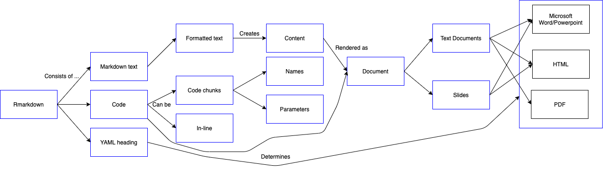
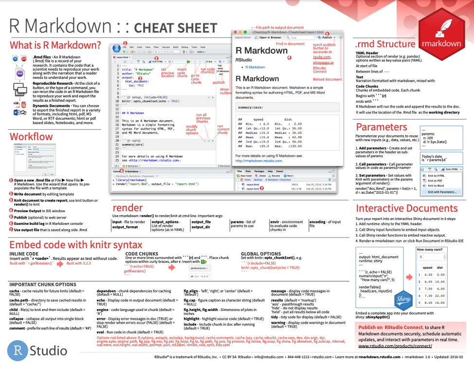

```{r setup, include=FALSE}
options(htmltools.dir.version = FALSE)
knitr::opts_chunk$set(
  fig.width=9, fig.height=3.5, fig.retina=3,
  out.width = "100%",
  cache = FALSE,
  echo = TRUE,
  message = FALSE, 
  warning = FALSE, 
  hiline = TRUE
)
options(width = 70)
```

name: title
class: left bottom hide-count

<!-- Slide Extras -->

```{r xaringan-extras, echo=FALSE, results="asis"}
# remotes::install_github("gadenbuie/xaringanExtra")
xaringanExtra::use_xaringan_extra(c(
  "tile_view"
  # "editable",
  # "animate",
  # "panelset"
))
```

<!-- Title Slide -->
<!-- <div class="talk-logo"></div> -->

.talk-meta[
.talk-title[
# `r rmarkdown::metadata$title`

`r rmarkdown::metadata$subtitle`
]

.talk-author[
`r paste(rmarkdown::metadata$author, collapse = " &middot; ")`<br>
.moffitt-gray[`r paste(rmarkdown::metadata$institute, collapse = ", ")`]
]

.talk-date.moffitt-gray[
`r knitr::knit(text = rmarkdown::metadata$date)`
]
]


```{css echo=FALSE}
/* Define title slide image or logo here */
.talk-logo {
  width: 400px;
  height: 750px;
  position: absolute;
  top: 6%;
  right: 7%;
  /* background-image: url('img/r4ds-cover.png'); */
  background-size: contain;
  background-repeat: no-repeat;
  background-position: contain;
}
```

<!-- Moffitt Logo and Slide Border ----

All slides except "title" and "inverse" slides
have the Moffitt Color Bar and logo.

Additional classes are provided to disable both:

- `class: no-logo` hides the logo
- `class: no-border` hides the border

or to force either to be shown

- `class: moffitt-slide-logo` shows the logo
- `class: moffitt-slide-border` shows the border
-->

---
class: inverse center middle

# Rmarkdown

---
## Rmarkdown


Allows you to share code, comments and outputs easily 

`r emo::ji("star")` REPRODUCIBLE! `r emo::ji("star")`

3 elements: YAML header, formatted text, code 

---
## Rmarkdown



---
## Formatted Text 

Rmarkdown uses regular markdown rules/syntax.

When you `knit` your document the final output will display according 
to the formatting rules on your `.Rmd`

.pull-left[
Text

```
_italic_
__bold__
```

Headers

```
# 1st Level

## 2nd Level
```
]

.pull-right[
Lists
```
- Item 1
- Item 2
    - Subitem
```

Insert images 
```

```
]

---
## Code

Code can be written as either code chunks or inline code

Code chunks can be named: ```` ```{r chunk-name} ````

Output can be modified by chunk options placed are wrapped around ```` ```{r} ```` and ```` ``` ````
  * `eval = FALSE` keeps code from being evaluated 
  * `echo = FALSE` keeps code from being displayed (output is still displayed)
  * `message = FALSE` and `warning = FALSE` keeps messages/warnings from being displayed
  * `results = 'hide'` and `fig.show = 'hide'` hides printed output and plots
  
---
## Caching

When a document is knit - it starts from a clean slate 

`r emo::ji("star")` REPRODUCIBLE! `r emo::ji("star")`

However you can cache a code chunk using the `cache = TRUE` option
  * `r emo::ji("warning")` Only that code chunk will be cached `r emo::ji("warning")`
  * `dependson` option can be given a charactr vector of EVERY chunk that the cached chunk depends on 
  
---
## YAML

Located at the top of your file and enclosed by `---`

Controls "whole document" parameters and settings 

```
---
title: "My super cool document"
author: 
  - Jordan Creed
output: html_document
---
```

---
## Parameters

Parameters are values that can be set for when you render a document 

```
---
output: html_document
params:
  cancer_type: "HNSC"
---
```

```` 
```
clinical %>% 
  filter(acronym == params$cancer_type)
```
````

`rmarkdown::render("my-markdown-doc.Rmd", params = list(cancer_type = "KIRC"))`

---
## 



[R Markdown: The Definitive Guide](https://bookdown.org/yihui/rmarkdown/basics.html)

